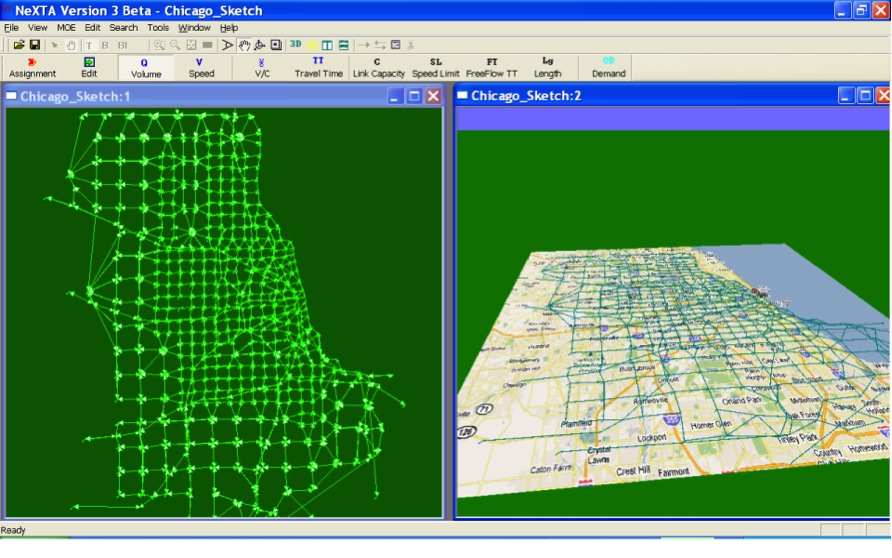
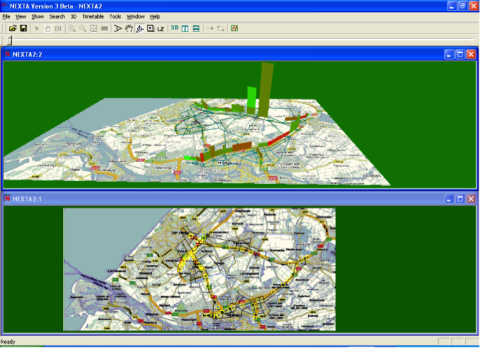
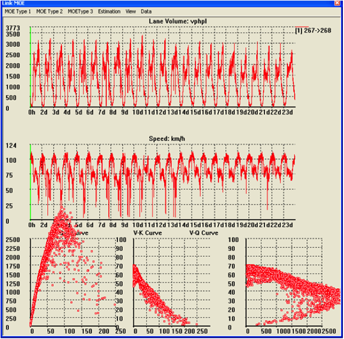
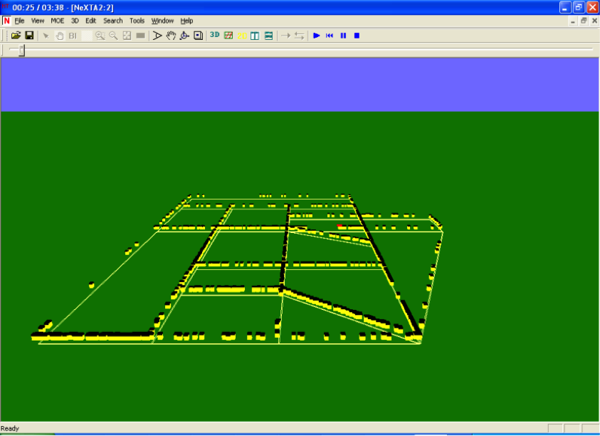
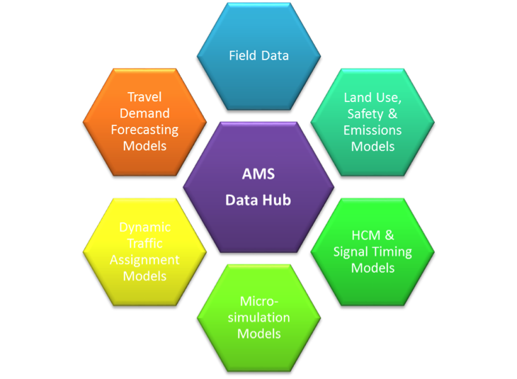

# DTALite/NeXTA_Software_Introduction

###NeXTA: Network EXplorer for Traffic Analysis

###DTALite: Light-weight Dynamic Traffic Assignment Engine

###NeXTA是一个开源的图形用户界面，主要功能包括建立路网及道路属性信息的输入，交通分配结果的处理和分析，仿真运行和数据输出。

1. 建网、导入、编辑、存储、导出以及可视化交通网

2. NEXTA 支持以下交通网络数据类型的导入：

  a.	GIS shape files 
  
  b.	Synchro UTDF and combined CSV files 
  
  c.	TMC-based sensor data (e.g. Inrix or traffic.com) 
  
  d.	Import google transit feed data 
  
  e.	Open dynsmart data set for reliability analysis 
  
  f.	NGSim data for vehicle analysis 
  
  g.	RAS train timetable format

NEXTA 支持以下交通网络数据类型的导出：
  
   a.	 Google Earth KML 
  
   b.	GIS shape file: node/link/zone, or convert user-defined CSV to shape 
  
   c.	synchro (UTDF) 
  
   d.	Use QEM tool to determine timing data 
  
   e.	Export to Visim ANM format 
  
   f.	Identify signal location, estimate signal timing based on QEM tool 
  
   g.	Subarea analysis to provide path flow pattern from Vissim simulation.

3. NEXTA 提供高效的多项目管理界面，如：
  
  a.	 多窗口同步演示 
  
  b.	在不同网络场景下进行同一点的选择

  c.	在不同网络场景下对同一条道路进行MOE比较 
  
  d.	比较基本网络和可选网络的道路MOE 
  
  e.	在不同仿真结果进行车辆轨迹分析 
  
  f.	仿真结果和实际采集数据比较 
  
  g.	以Link 为基础进行仿真结果分析 
  
  h.	以路径旅行时间为基础进行仿真结果分析 
  
  i.	仿真结果校核，用回归分析确定异常值
  
4. 导入多日的交通分析数据并且提供多条件路径查找功能

5. 进行仿真和可视化动态交通仿真结果

###DTALite 是轻量级的中观交通仿真引擎，它的特点在于计算机运行上简单但计算理论严格的交通仿真模型；其并行计算功能利用了目前普及的多核CPU配置大大加快仿真进程；例如，在一个大范围路网内进行以车辆为对象的动态交通分配，对一百万辆车进行20个循环迭代，只需要一个小时。

适用范围包括：

- 大规模网络动态交通分配

	- 典型网路举例：2000交通小区，20000个路段，200万-1000万个车辆

- 网络能力规划
  
	• 添加/移除车道，为信号配时优化（ synchro ）或微观仿真（ VISSIM ）准备基础数据

	• 导出交通能力分析包（HCM高速能力、旅行时间可靠性）

- 施工区的运用，道路价格的运用： 基于动态费用、时间异构值的Agent模型

4.	排放研究交通安全研究

DTALite 与NeXTA AMS 数据库格式的优势：

a.	道路类型数量没有限制Unlimited number of link types

b.	交通需求的类型和文件数量没有限制，可以进行24小时的数据加载，灵活的路网/shape file转换 

c.	交通需求数据类型可以是多种格式：3列OD数据；多列数据（如：SOV, HOV, Truck, subtotal）；矩阵；15分钟间隔的交通需求矩阵；以车辆为单位的交通需求数据

d.	典型车辆类型：将trip类型转换为车辆类型，不同车辆类型的排放率，车辆的使用年限等

e.	Value Of Time 分布 

f.	检测数据的类型：路段检测数据，车道检测数据，用户自定义的检测时间间隔车速检测数据，密度检测数据，出行时间数据

g.	特定的车辆转向参数设定

DTALite/NEXTA package 提供如下数据分析结果：

  a.	车辆轨迹Agent based trajectory 

  b.	路段MOEs，路段宽度显示，用户定义的路间offset 

  c.	基于动态分配结果的安全性和排放统计结果 

  d.	用于可定义路径的动态路径出行时间 

  e.	以OD为对象的MOEs 

  f.	路段选取分析 

  g.	路径选取分析 

  h.	局部地区分析

  i.	MOEs和其它多种类别的图形化结果展示

Network EXplorer for Traffic Analysis (NEXTA) (Version 3) is an open-source GUI that aims to facilitate the preparation, post-processing and analysis of transportation assignment, simulation and scheduling datasets. NeXTA Version 3 uses DTALite, a fast dynamic traffic assignment engine, for transportation network analysis.

DTALite uses a computationally simple but theoretically rigorous traffic queuing model in its lightweight mesoscopic simulation engine. Its built-in parallel computing capability dramatically speeds-up the analysis process by using widely available multi-core CPU hardware. It takes about 1 hour to compute agent-based dynamic traffic equilibrium for a large-scale network with 1 million vehicles for 20 iterations.
